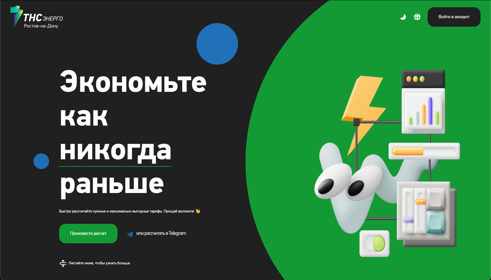
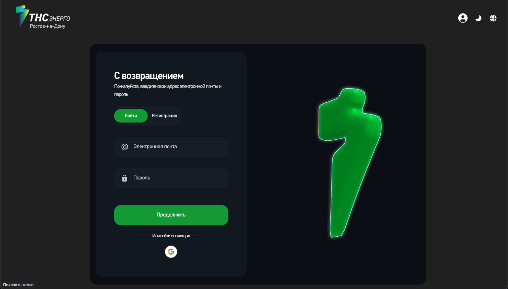

# Frontend часть кейса ТНС Энерго | Сервис для определения оптимальной ценовой категории для клиентов 





Этот проект представляет собой React-приложение, написанное на TypeScript, с использованием методологии Feature-Sliced Design (FSD). В качестве инструментов сборки применяется Webpack, а для управления состоянием используется Redux. Также в проекте реализована поддержка мультиязычности через i18n.

## Структура проекта
Проект организован по принципам Feature-Sliced Design (FSD), что упрощает масштабирование и поддержку кода. Основные сущности и модули разбиты по функциональным слоям.

## Основные технологии
- **React** — библиотека для построения пользовательских интерфейсов.
- **TypeScript** — статическая типизация для повышения надежности кода.
- **Redux** — управление состоянием приложения.
- **Webpack** — сборка проекта и оптимизация ресурсов.
- **i18n** — поддержка мультиязычности.
- **Feature-Sliced Design** — методология структурирования проекта.

## Темизация
В проекте реализована удобная система управления цветовыми темами, что позволяет легко добавлять новые темы и переключаться между ними.

## Запуск проекта
1. Установите зависимости:
   ```sh
   npm install
   ```
2. Запустите проект в режиме разработки:
   ```sh
   npm run start
   ```
3. Для сборки проекта используйте команду:
   ```sh
   npm run build:prod
   ```